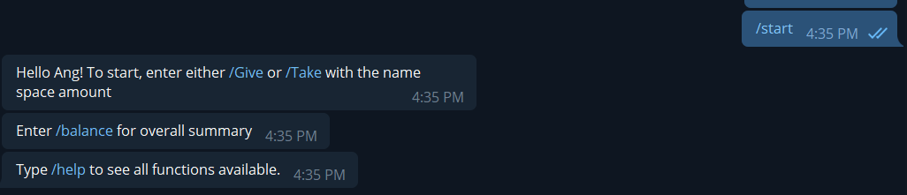
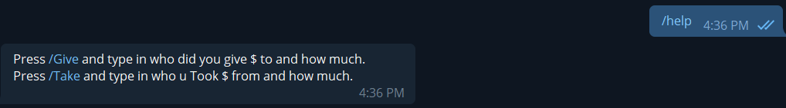
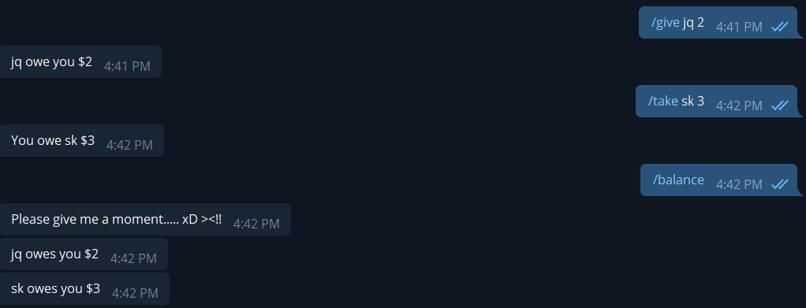
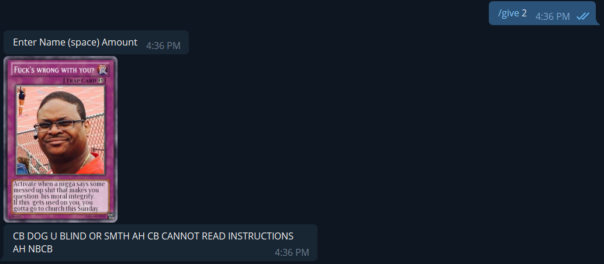

# HACKNROLL (ShaoKiat Loan Shark)
A telegram chat bot that helps you track your debts!

|key features|Description|
|------------|-----------|
|/start|To start up the bot tracker|
|/Give (Name) (Amount)|Begin tracker, give amount to said name|
|/Take (Name) (Amount)|Said name pays you and tracker sums it up accordingly|
|/Balance|Displays your current balance with various other people|

<h1>Initialising the bot</h1>

Simple initialisaion, initialise with /start as shown in the feature table

  
<h1>help function</h1>

Help function will give you instructions on how to use this bot. Mainly give and take

  
<h1>Example</h1>

Above is an example usage of this telegram bot. Do take note that the /balance command here helps is not empty.

  
<h1>Checking of balance</h1>

/Balance displays this result if there are no outstanding differences.

  
<h1>Error usage</h1>

In the event you give an invalid command, the bot will prompt you to give a correct one as shown above.

